# OpenClaw 项目架构整体详解

> 本文档详细描述了 OpenClaw 项目的架构设计、组件关系和核心功能调用链。

---

## 目录

1. [项目概述](#1-项目概述)
2. [整体架构](#2-整体架构)
3. [架构分层详解](#3-架构分层详解)
4. [核心功能调用链](#4-核心功能调用链)
5. [关键设计模式](#5-关键设计模式)
6. [扩展点说明](#6-扩展点说明)
7. [数据流图](#7-数据流图)

---

## 1. 项目概述

### 1.1 项目定位

OpenClaw 是一个**多渠道 AI 网关系统**，核心功能是：
- 将各种消息平台（Telegram、Discord、WhatsApp、Slack、Signal、iMessage）连接到 AI 代理
- 提供统一的 CLI 和网关接口
- 支持插件化扩展新的渠道和功能
- 实现智能消息路由和会话管理

### 1.2 技术栈

| 层级 | 技术 |
|------|------|
| 运行时 | Node.js 22+, Bun |
| 语言 | TypeScript (ESM) |
| CLI 框架 | Commander.js |
| 通信协议 | WebSocket, HTTP/HTTPS |
| 数据库 | SQLite (with sqlite-vec) |
| 测试框架 | Vitest |
| 构建工具 | TypeScript Compiler, Rolldown |
| 代码质量 | Oxlint, Oxfmt |

### 1.3 目录结构概览

```
openclaw/
├── src/                          # 核心源代码
│   ├── cli/                      # CLI 层
│   ├── commands/                 # 命令实现
│   ├── agents/                   # AI 代理系统
│   ├── channels/                 # 渠道抽象和注册
│   ├── gateway/                  # 网关服务器
│   ├── routing/                  # 消息路由
│   ├── config/                   # 配置管理
│   ├── media/                    # 媒体处理
│   ├── media-understanding/      # AI 媒体理解
│   ├── providers/                # AI 提供者集成
│   ├── memory/                   # 记忆和搜索
│   ├── plugins/                  # 插件系统
│   └── [渠道实现]/
│       ├── telegram/
│       ├── discord/
│       ├── slack/
│       ├── signal/
│       ├── imessage/
│       └── web/ (WhatsApp)
├── extensions/                   # 外部插件
│   ├── msteams/
│   ├── matrix/
│   ├── zalo/
│   └── ...
├── apps/                         # 移动应用
│   ├── ios/
│   ├── android/
│   └── macos/
├── docs/                         # 文档
└── dist/                         # 构建输出
```

---

## 2. 整体架构

### 2.1 系统架构图

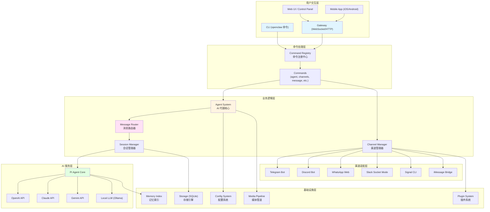

### 2.2 核心组件关系图

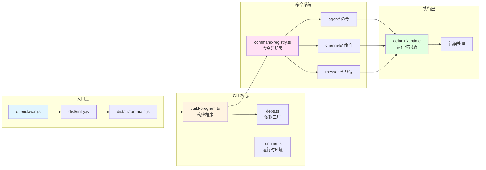

---

## 3. 架构分层详解

### 3.1 CLI 层 (`src/cli/`)

#### 职责
- 解析命令行参数
- 构建命令树
- 管理命令执行生命周期
- 提供依赖注入

#### 关键文件

| 文件 | 职责 |
|------|------|
| `run-main.js` | CLI 主入口，处理环境配置 |
| `program/build-program.ts` | 构建 Commander 程序 |
| `program/command-registry.ts` | 命令注册表 |
| `deps.ts` | 依赖工厂，创建渠道发送函数 |
| `runtime.ts` | 运行时环境抽象 |
| `progress.ts` | 进度显示和用户反馈 |

#### 程序构建流程

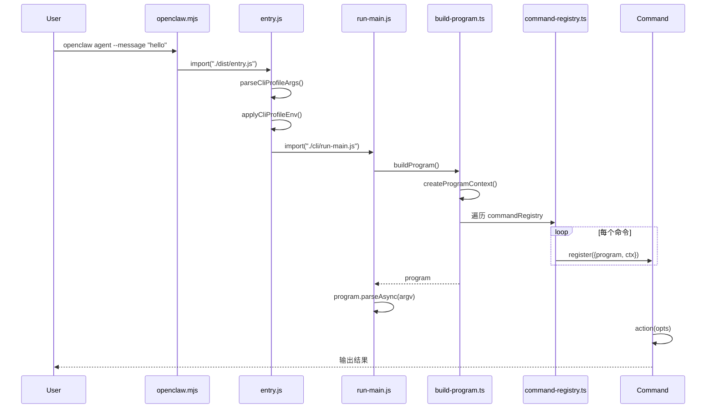

### 3.2 命令层 (`src/commands/`)

#### 命令分类

| 类别 | 命令 | 说明 |
|------|------|------|
| 代理 | `agent` | 运行 AI 代理回合 |
| 渠道 | `channels` | 管理消息渠道 |
| 消息 | `message send` | 发送消息 |
| 配置 | `config` | 管理配置 |
| 状态 | `status` | 查看系统状态 |
| 引导 | `onboarding` | 首次配置向导 |
| 会话 | `sessions` | 管理会话 |

#### 依赖注入模式

```typescript
// src/cli/deps.ts
export type CliDeps = {
  sendMessageWhatsApp: typeof sendMessageWhatsApp;
  sendMessageTelegram: typeof sendMessageTelegram;
  sendMessageDiscord: typeof sendMessageDiscord;
  sendMessageSlack: typeof sendMessageSlack;
  sendMessageSignal: typeof sendMessageSignal;
  sendMessageIMessage: typeof sendMessageIMessage;
  // ...
};

export function createDefaultDeps(): CliDeps {
  return {
    sendMessageWhatsApp,
    sendMessageTelegram,
    sendMessageDiscord,
    sendMessageSlack,
    sendMessageSignal,
    sendMessageIMessage,
    // ...
  };
}
```

### 3.3 Agent 系统层 (`src/agents/`)

#### 核心组件

```
src/agents/
├── cli-session.ts              # CLI 会话 ID 管理
├── auth-profiles/              # 认证配置系统
│   ├── types.ts                # 认证类型定义
│   ├── store.ts                # 配置存储
│   ├── profiles.ts             # 配置文件操作
│   ├── usage.ts                # 使用统计和冷却
│   └── order.ts                # 配置文件顺序管理
├── bash-tools/                 # Shell 工具执行
│   ├── exec.ts                 # 直接执行
│   └── process.ts              # 进程管理
├── pi-embedded-runner/         # Pi Agent 集成
│   ├── run.ts                  # 运行时管理
│   ├── subscribe.ts            # 订阅机制
│   └── tools.ts                # 工具适配
├── model-auth.ts               # 模型认证处理
├── routing/                    # 消息路由
│   └── session-key.ts          # 会话密钥管理
└── sandbox/                    # 代码执行沙盒
```

#### 认证类型

```typescript
// API Key 认证
type ApiKeyCredential = {
  type: "api_key";
  provider: string;
  key: string;
  email?: string;
};

// Token 认证
type TokenCredential = {
  type: "token";
  provider: string;
  token: string;
  expires?: number;
  email?: string;
};

// OAuth 认证
type OAuthCredential = {
  type: "oauth";
  provider: string;
  clientId?: string;
  email?: string;
};
```

#### 认证配置轮询机制

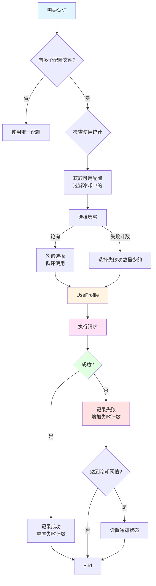

### 3.4 渠道层 (`src/channels/`)

#### 渠道插件接口

```typescript
type ChannelPlugin<ResolvedAccount = any> = {
  id: ChannelId;                          // 渠道唯一标识
  meta: ChannelMeta;                      // 渠道元数据
  capabilities: ChannelCapabilities;      // 能力声明
  config: ChannelConfigAdapter<ResolvedAccount>;     // 配置适配器
  outbound?: ChannelOutboundAdapter;      // 出站消息适配器
  status?: ChannelStatusAdapter<ResolvedAccount>;    // 状态监控适配器
  gateway?: ChannelGatewayAdapter<ResolvedAccount>;  // 网关适配器
  security?: ChannelSecurityAdapter<ResolvedAccount>;// 安全适配器
  actions?: ChannelMessageActionAdapter;  // 消息动作适配器
};
```

#### 渠道能力声明

```typescript
type ChannelCapabilities = {
  chatTypes: ChatType[];          // ["direct", "group", "channel", "thread"]
  reactions?: boolean;            // 支持表情反应
  threads?: boolean;              // 支持主题线程
  media?: boolean;                // 支持媒体消息
  nativeCommands?: boolean;       // 支持斜杠命令
  blockStreaming?: boolean;       // 阻塞流式输出
  polls?: boolean;                // 支持投票
};
```

#### 支持的渠道

| 渠道 | 实现 | 特点 |
|------|------|------|
| Telegram | Bot API | 简单易用，支持 Webhook |
| Discord | Bot API | 丰富的交互功能，支持 Slash 命令 |
| WhatsApp | Baileys Web | 无需官方 API，功能完整 |
| Slack | Socket Mode | 企业集成友好 |
| Signal | signal-cli | 端到端加密 |
| iMessage | AppleScript | macOS 平台原生 |

### 3.5 网关层 (`src/gateway/`)

#### 网关架构

```
src/gateway/
├── boot.ts                      # 启动引导
├── client.ts                    # WebSocket 客户端
├── server-http.ts               # HTTP 服务器
├── server-channels.ts           # 通道管理器
├── server-chat.ts               # 聊天处理器
├── server-methods/              # 方法处理器
│   ├── agent.ts                 # 代理执行
│   ├── chat.ts                  # 聊天管理
│   ├── send.ts                  # 消息发送
│   ├── channels.ts              # 通道管理
│   ├── config.ts                # 配置管理
│   └── sessions.ts              # 会话管理
└── protocol/                    # 协议定义
    ├── frames.ts                # 帧结构
    ├── index.ts                 # 协议验证
    └── schema/                  # 类型定义
```

#### 请求/响应帧结构

```typescript
// 请求帧
type RequestFrame = {
  id: string;                    // 请求 ID
  method: string;                // 方法名
  params?: unknown;              // 参数
  device?: {                     // 设备认证
    id: string;
    role: "operator" | "node";
    token?: string;
    tlsFingerprint?: string;
  };
};

// 响应帧
type ResponseFrame = {
  id: string;                    // 对应的请求 ID
  result?: unknown;              // 成功结果
  error?: {                      // 错误信息
    code: string;
    message: string;
    details?: unknown;
  };
};

// 事件帧
type EventFrame = {
  event: string;                 // 事件名
  data?: unknown;                // 事件数据
};
```

#### 权限系统

```typescript
// 角色
type Role = "operator" | "node";

// 权限范围
type Scope =
  | "operator.admin"       // 管理员权限
  | "operator.read"       // 只读权限
  | "operator.write"      // 写入权限
  | "operator.approvals"  // 审批权限
  | "operator.pairing";   // 配对权限
```

### 3.6 路由层 (`src/routing/`)

#### 路由解析优先级

```
1. Peer 绑定      → 精确匹配特定用户/群组
2. 父级 Peer 绑定 → 线程继承父级绑定
3. Guild/Team 绑定 → 服务器/团队级别
4. 账户绑定        → 特定账户
5. 通道绑定        → 默认通道
6. 默认代理        → 系统默认代理
```

#### 路由匹配流程

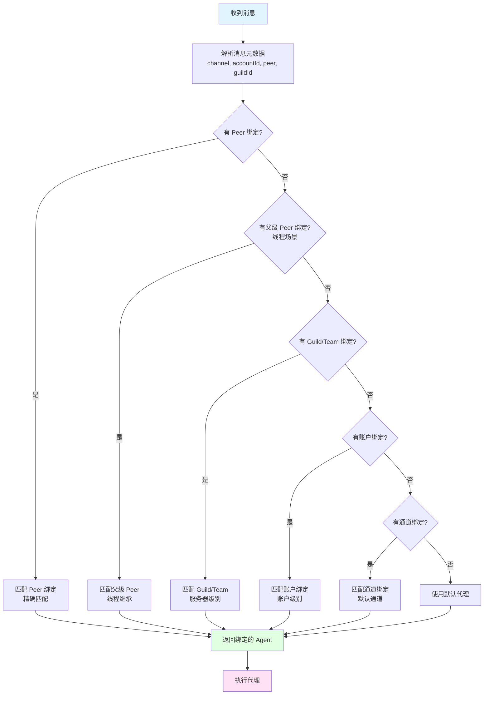

#### 会话键生成

```typescript
// 主会话键
"agent:main"                    // 默认代理
"agent:project-x"               // 特定代理

// 完整会话键（带身份链接）
"agent:main:telegram:dm:123456789"
"agent:project-x:discord:guild:987654321:channel:111222333"

// 全局会话
"global"
```

### 3.7 配置层 (`src/config/`)

#### 配置加载流程

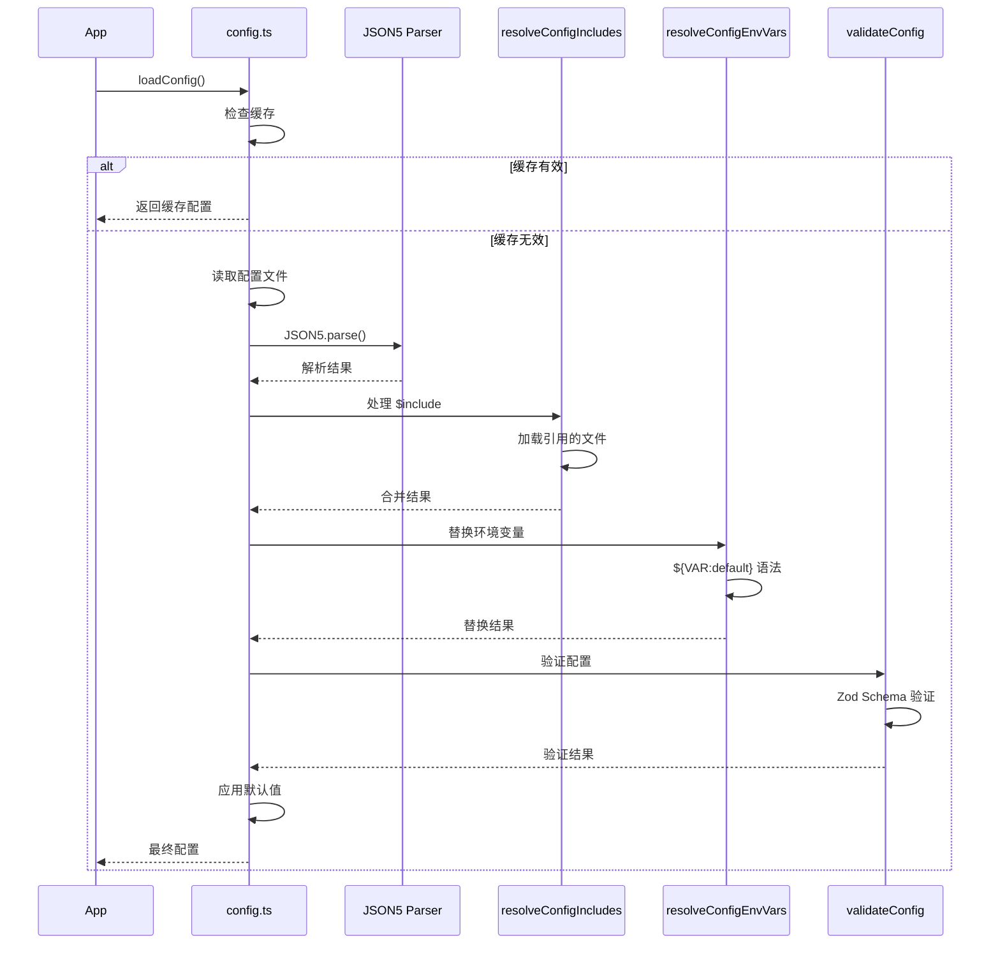

#### 配置结构

```typescript
type OpenClawConfig = {
  $meta?: {                      // 元数据
    versionModified?: string;    // 修改版本
  };

  // 核心配置
  gateway?: {                    // 网关配置
    mode?: "local" | "remote";
    port?: number;
    bind?: "all" | "loopback";
  };
  agent?: {                      // 代理配置
    defaultAgentId?: string;
    model?: string;
  };

  // 渠道配置
  channels?: {
    telegram?: TelegramConfig;
    discord?: DiscordConfig;
    whatsapp?: WhatsAppConfig;
    // ...
  };

  // 工具配置
  tools?: {
    exec?: {                     // 命令执行
      enabled?: boolean;
      allow?: string[];
      deny?: string[];
      requireApproval?: string[];
    };
    media?: {                    // 媒体处理
      concurrency?: number;
      models?: MediaModelEntry[];
    };
  };

  // 会话配置
  sessions?: {
    reset?: {                    // 会话重置
      daily?: { time: string; timezone?: string };
      idle?: number;
    };
    store?: {                    // 会话存储
      path?: string;
      ttl?: number;
    };
  };

  // 插件配置
  plugins?: {
    entries?: PluginEntry[];
  };

  // Hooks 配置
  hooks?: {
    enabled?: boolean;
    mappings?: HookMapping[];
  };
};
```

### 3.8 媒体处理层 (`src/media/` & `src/media-understanding/`)

#### 媒体处理管道

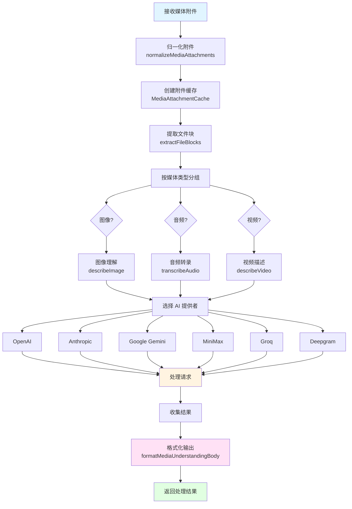

#### 媒体提供者能力

| 提供者 | 图像 | 音频 | 视频 | 默认模型 |
|--------|------|------|------|----------|
| OpenAI | ✓ | ✓ | ✗ | gpt-4o |
| Anthropic | ✓ | ✗ | ✗ | claude-opus-4-5 |
| Google | ✓ | ✓ | ✓ | gemini-2-flash |
| Groq | ✗ | ✓ | ✗ | - |
| Deepgram | ✗ | ✓ | ✗ | - |
| MiniMax | ✓ | ✗ | ✗ | MiniMax-VL-01 |

### 3.9 记忆和搜索层 (`src/memory/`)

#### 混合搜索架构

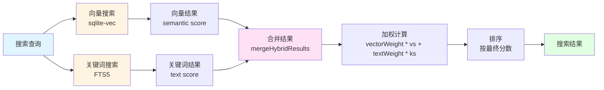

#### 记忆索引管理

```typescript
class MemoryIndexManager {
  // 多来源索引
  private readonly sources: Set<MemorySource>;

  // 热缓存
  private sessionWarm = new Set<string>();

  // 文件监控
  private watcher: FSWatcher | null;

  // 向量搜索
  searchVector(params: {
    query: string;
    limit?: number;
    minScore?: number;
  });

  // 关键词搜索
  searchKeyword(params: {
    query: string;
    limit?: number;
  });

  // 混合搜索
  searchHybrid(params: {
    query: string;
    limit?: number;
    vectorWeight?: number;
    textWeight?: number;
  });
}
```

---

## 4. 核心功能调用链

### 4.1 CLI 命令执行流程

以 `openclaw agent --message "hello"` 为例：

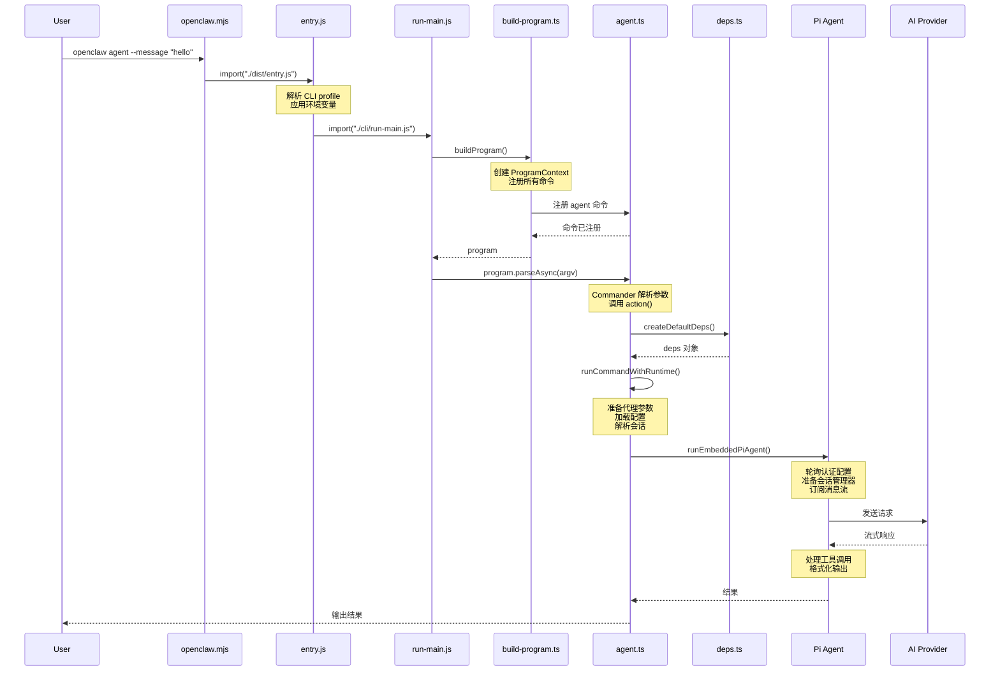

### 4.2 消息接收和处理流程

以 Telegram 消息为例：

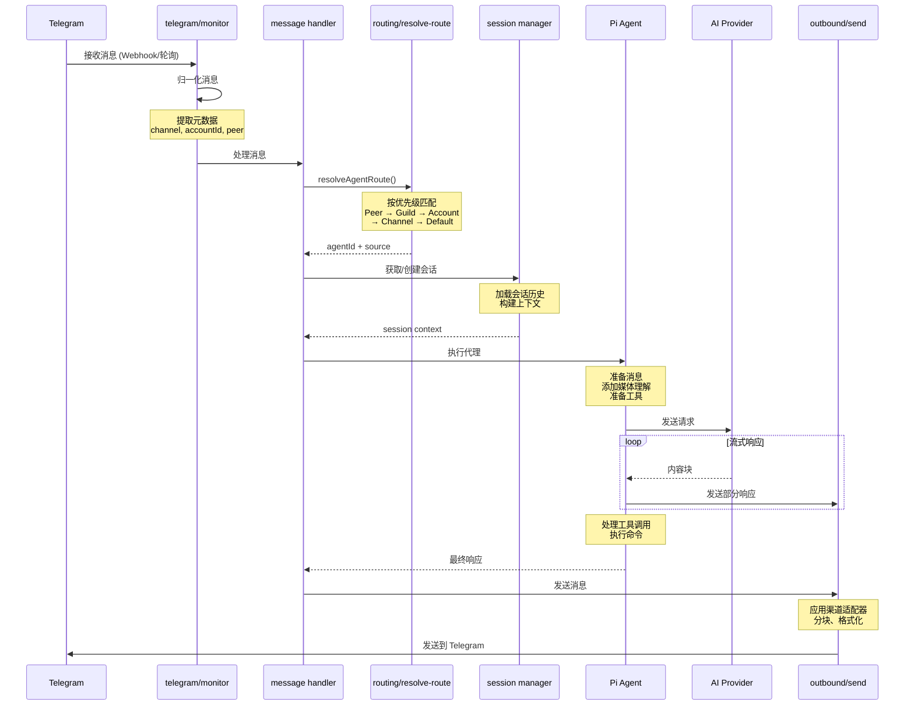

### 4.3 媒体处理流程

以用户发送图片为例：

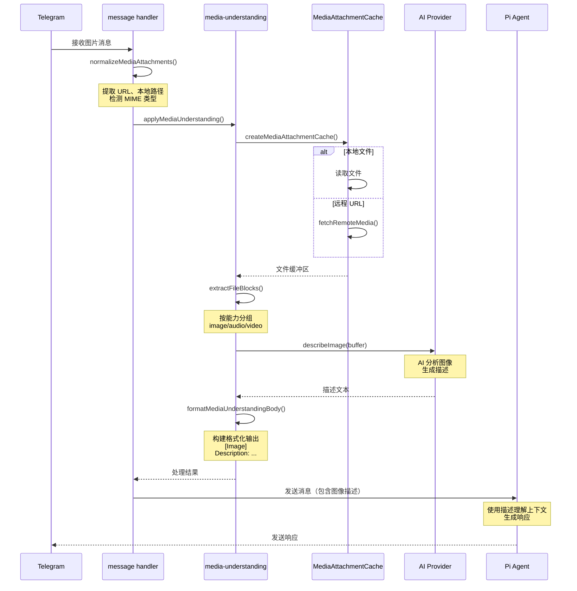

### 4.4 网关 WebSocket 通信流程

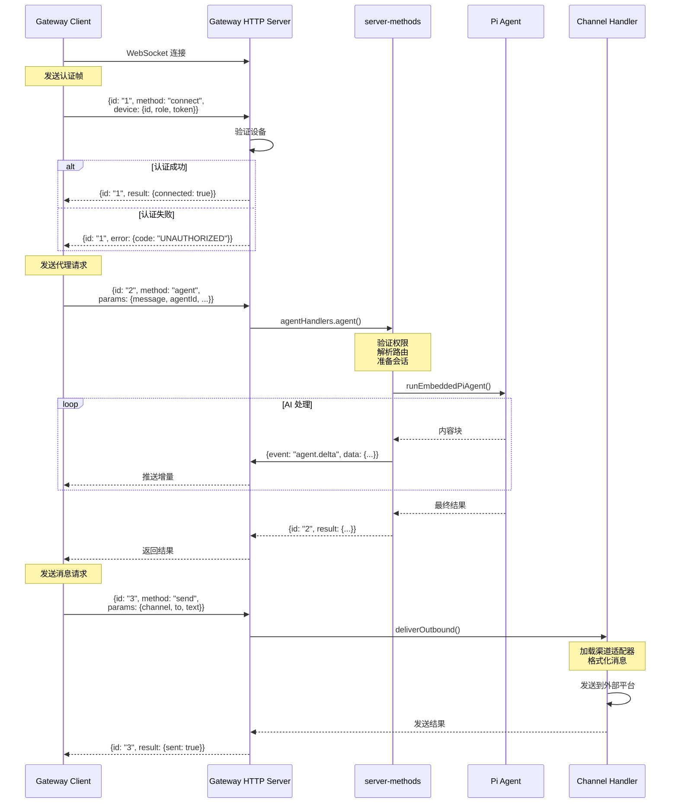

### 4.5 配置加载和热重载流程

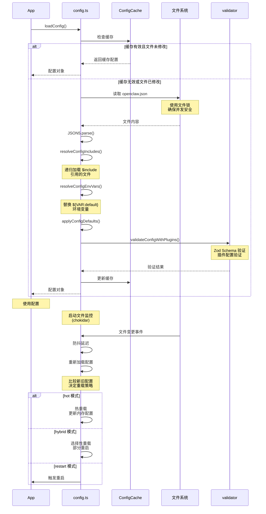

---

## 5. 关键设计模式

### 5.1 依赖注入模式

**位置**: `src/cli/deps.ts`

**目的**: 解耦命令实现和具体渠道发送函数

```typescript
// 定义依赖接口
type CliDeps = {
  sendMessageTelegram: typeof sendMessageTelegram;
  sendMessageDiscord: typeof sendMessageDiscord;
  // ...
};

// 工厂函数创建依赖
function createDefaultDeps(): CliDeps {
  return {
    sendMessageTelegram,
    sendMessageDiscord,
    // ...
  };
}

// 命令接收依赖
async function agentCommand(opts: AgentOpts, runtime: RuntimeEnv, deps: CliDeps) {
  // 使用 deps.sendMessageTelegram 等
}
```

**优点**:
- 易于测试（可注入 mock）
- 支持多种实现
- 降低耦合度

### 5.2 插件模式

**位置**: `src/channels/plugins/`, `src/plugins/`

**目的**: 动态扩展渠道和功能

```typescript
// 插件接口
type ChannelPlugin<ResolvedAccount = any> = {
  id: ChannelId;
  meta: ChannelMeta;
  capabilities: ChannelCapabilities;
  config: ChannelConfigAdapter<ResolvedAccount>;
  outbound?: ChannelOutboundAdapter;
  status?: ChannelStatusAdapter<ResolvedAccount>;
  // ...
};

// 插件注册表
const registry: ChannelPlugin[] = [
  telegramPlugin,
  discordPlugin,
  whatsappPlugin,
  // ...
];

// 动态加载
function loadChannelPlugin(id: ChannelId): ChannelPlugin {
  return registry.find(p => p.id === id);
}
```

**优点**:
- 开放封闭原则
- 易于添加新渠道
- 运行时扩展

### 5.3 策略模式

**位置**: `src/routing/resolve-route.ts`, `src/agents/auth-profiles/`

**目的**: 根据不同情况选择不同策略

```typescript
// 路由策略
type RouteBindingMatch = {
  peer?: RoutePeer;
  guildId?: string;
  accountId?: string;
  channelId?: string;
};

function resolveAgentRoute(params: ResolveInput): ResolvedRoute {
  // 按优先级匹配不同的策略
  if (peerMatch) return peerMatch.agentId;
  if (guildMatch) return guildMatch.agentId;
  if (accountMatch) return accountMatch.agentId;
  // ...
}

// 认证配置选择策略
function selectAuthProfile(
  profiles: AuthProfile[],
  strategy: "round-robin" | "failure-count"
): AuthProfile {
  if (strategy === "round-robin") {
    return rotateProfiles(profiles);
  } else {
    return selectByFailureCount(profiles);
  }
}
```

### 5.4 工厂模式

**位置**: `src/cli/deps.ts`, `src/channels/plugins/outbound/load.ts`

**目的**: 创建复杂的对象

```typescript
// 依赖工厂
function createDefaultDeps(): CliDeps {
  return {
    sendMessageWhatsApp,
    sendMessageTelegram,
    sendMessageDiscord,
    // ...
  };
}

// 渠道处理器工厂
async function createChannelHandler(params: {
  cfg: OpenClawConfig;
  channel: ChannelId;
  to: string;
}): Promise<ChannelHandler> {
  const outbound = await loadChannelOutboundAdapter(params.channel);
  return new ChannelHandler(outbound);
}
```

### 5.5 观察者模式

**位置**: `src/gateway/server-chat.ts`, `src/telegram/monitor/`

**目的**: 事件驱动的消息处理

```typescript
// 事件监听器
type MessageListener = (message: NormalizedMessage) => void;

class EventEmitter {
  private listeners: MessageListener[] = [];

  on(listener: MessageListener) {
    this.listeners.push(listener);
  }

  emit(message: NormalizedMessage) {
    this.listeners.forEach(l => l(message));
  }
}

// 在 Telegram 监控中使用
const emitter = new EventEmitter();
emitter.on(async (msg) => {
  await handleMessage(msg);
});
```

### 5.6 单例模式

**位置**: `src/config/`, `src/memory/manager.ts`

**目的**: 确保全局唯一实例

```typescript
// 配置缓存单例
let configCache: OpenClawConfig | null = null;
let cacheTimestamp = 0;

function loadConfig(): OpenClawConfig {
  const now = Date.now();
  if (configCache && (now - cacheTimestamp) < CACHE_TTL) {
    return configCache;
  }

  configCache = loadConfigImpl();
  cacheTimestamp = now;
  return configCache;
}

// 记忆索引管理器单例
let memoryIndexManager: MemoryIndexManager | null = null;

function getMemoryIndexManager(): MemoryIndexManager {
  if (!memoryIndexManager) {
    memoryIndexManager = new MemoryIndexManager();
  }
  return memoryIndexManager;
}
```

### 5.7 装饰器模式

**位置**: `src/cli/runtime.ts`

**目的**: 动态添加功能

```typescript
// 运行时装饰器
function runCommandWithRuntime(
  runtime: RuntimeEnv,
  action: () => Promise<void>
): Promise<void> {
  try {
    // 清除进度行
    clearActiveProgressLine();
    // 执行实际操作
    await action();
  } catch (err) {
    // 错误处理装饰
    runtime.error(String(err));
    runtime.exit(1);
  }
}
```

### 5.8 责任链模式

**位置**: `src/routing/resolve-route.ts`

**目的**: 路由匹配链

```typescript
function resolveAgentRoute(params: ResolveInput): ResolvedRoute {
  const bindings = params.cfg.bindings ?? [];

  // 链式匹配
  for (const binding of bindings) {
    if (matchesPeer(binding.match, params.peer)) {
      return {
        agentId: binding.agentId,
        source: "binding.peer"
      };
    }
  }

  // 继续链...
  if (matchesGuild(...)) { /* ... */ }
  if (matchesAccount(...)) { /* ... */ }

  // 默认处理器
  return defaultRoute;
}
```

---

## 6. 扩展点说明

### 6.1 添加新渠道

#### 步骤

1. **创建插件目录**
   ```
   extensions/mychannel/
   ├── package.json
   ├── src/
   │   └── channel.ts
   └── tsconfig.json
   ```

2. **实现渠道插件**
   ```typescript
   // src/channel.ts
   import type { ChannelPlugin } from "openclaw/plugin-sdk";

   export const mychannelPlugin: ChannelPlugin<ResolvedMyChannelAccount> = {
     id: "mychannel",
     meta: {
       label: "My Channel",
       selectionLabel: "My Channel (Custom)",
       detailLabel: "My Channel Bot",
       docsPath: "/channels/mychannel",
       blurb: "自定义渠道集成",
       systemImage: "cloud",
     },
     capabilities: {
       chatTypes: ["direct", "group"],
       reactions: true,
       media: true,
     },
     config: {
       listAccountIds: (cfg) => Object.keys(cfg.channels?.mychannel?.accounts ?? {}),
       resolveAccount: (cfg, accountId) => {
         const account = cfg.channels?.mychannel?.accounts?.[accountId];
         return {
           accountId,
           token: account?.token,
           // ...
         };
       },
       isConfigured: (account) => Boolean(account?.token),
     },
     outbound: {
       deliveryMode: "direct",
       sendText: async ({ to, text, accountId }) => {
         // 实现发送逻辑
       },
       sendMedia: async ({ to, media, accountId }) => {
         // 实现媒体发送
       },
     },
     status: {
       probeAccount: async ({ account, timeoutMs }) => {
         // 实现探测逻辑
       },
     },
     gateway: {
       startMonitor: async ({ cfg, accountId, messageHandler }) => {
         // 启动监控服务
       },
       stopMonitor: async ({ accountId }) => {
         // 停止监控服务
       },
     },
   };
   ```

3. **注册插件**
   ```typescript
   // 在 src/plugins/registry.ts 或插件 package.json 中
   export default {
     id: "mychannel",
     type: "channel",
     register: (registry) => {
       registry.registerChannel(mychannelPlugin);
     }
   };
   ```

### 6.2 添加新命令

#### 步骤

1. **创建命令文件**
   ```typescript
   // src/commands/mycommand/index.ts
   import { Command } from "commander";

   export function registerMyCommand(program: Command) {
     program
       .command("mycommand")
       .description("My custom command")
       .option("-v, --verbose", "Verbose output")
       .action(async (opts) => {
         console.log("Running my command", opts);
       });
   }
   ```

2. **注册到命令表**
   ```typescript
   // src/cli/program/command-registry.ts
   export const commandRegistry: CommandRegistration[] = [
     // ...
     {
       id: "mycommand",
       register: ({ program }) => registerMyCommand(program),
     },
   ];
   ```

### 6.3 添加 AI 提供者

#### 步骤

1. **实现提供者接口**
   ```typescript
   // src/providers/myprovider/index.ts
   import type { AIProvider } from "../types";

   export const myProvider: AIProvider = {
     id: "myprovider",
     name: "My Provider",

     // 流式聊天
     chatStream: async function* (params) {
       const response = await fetch("https://api.myprovider.com/v1/chat", {
         method: "POST",
         headers: {
           "Authorization": `Bearer ${params.apiKey}`,
           "Content-Type": "application/json",
         },
         body: JSON.stringify({
           model: params.model,
           messages: params.messages,
         }),
       });

       yield* parseStream(response);
     },

     // 嵌入生成
     embed: async (params) => {
       // 实现嵌入逻辑
     },
   };
   ```

2. **注册提供者**
   ```typescript
   // src/providers/registry.ts
   export const PROVIDERS = [
     openaiProvider,
     anthropicProvider,
     googleProvider,
     myProvider,  // 添加新的提供者
   ];
   ```

### 6.4 添加媒体理解提供者

#### 步骤

1. **实现媒体提供者接口**
   ```typescript
   // src/media-understanding/providers/myprovider.ts
   import type { MediaUnderstandingProvider } from "./types";

   export const myMediaProvider: MediaUnderstandingProvider = {
     id: "myprovider",
     capabilities: ["image", "audio", "video"],

     describeImage: async (req) => {
       const response = await fetch("https://api.myprovider.com/v1/vision", {
         method: "POST",
         body: JSON.stringify({
           image: req.buffer,
           prompt: "Describe this image in detail",
         }),
       });

       const data = await response.json();
       return {
         text: data.description,
         model: req.model,
         provider: "myprovider",
       };
     },

     transcribeAudio: async (req) => {
       // 实现音频转录
     },

     describeVideo: async (req) => {
       // 实现视频描述
     },
   };
   ```

2. **注册到注册表**
   ```typescript
   // src/media-understanding/providers/index.ts
   export function buildMediaUnderstandingRegistry(overrides?: Record<string, MediaUnderstandingProvider>) {
     const registry = new Map();

     // 添加内置提供者
     for (const provider of [...BUILT_IN_PROVIDERS]) {
       registry.set(provider.id, provider);
     }

     // 应用自定义覆盖
     if (overrides) {
       for (const [id, provider] of Object.entries(overrides)) {
         registry.set(id, provider);
       }
     }

     return registry;
   }
   ```

### 6.5 添加 Hook

#### 步骤

1. **配置 Hook**
   ```json
   // ~/.openclaw/openclaw.json
   {
     "hooks": {
       "enabled": true,
       "mappings": [
         {
           "match": {
             "path": "/webhook/github"
           },
           "action": "wake",
           "channel": "discord",
           "to": "123456789",
           "agentId": "main"
         }
       ]
     }
   }
   ```

2. **实现 Hook 处理器**
   ```typescript
   // src/hooks/handler.ts
   export async function handleWebhook(params: WebhookParams) {
     const hook = findMatchingHook(params);

     if (hook?.action === "wake") {
       await sendMessage({
         channel: hook.channel,
         to: hook.to,
         text: params.body,
       });
     }
   }
   ```

---

## 7. 数据流图

### 7.1 端到端消息流

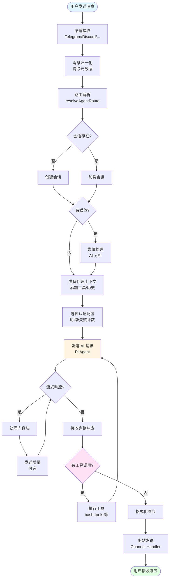

### 7.2 配置流

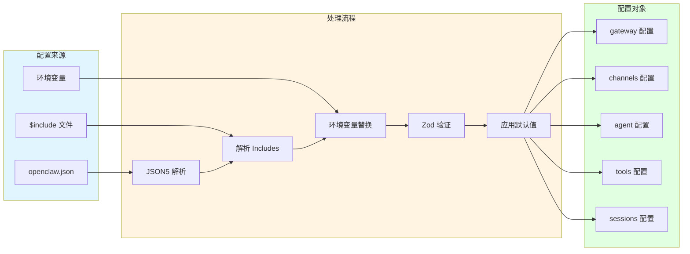

### 7.3 插件系统流

```mermaid
flowchart TD
    Start([启动时]) --> LoadCore[加载核心渠道<br/>内置插件]

    LoadCore --> ScanExtensions[扫描 extensions/ 目录]

    ScanExtensions --> LoadExt{发现扩展?}

    LoadExt -->|是| LoadExtPlugins[加载扩展插件<br/>jiti 动态导入]
    LoadExt -->|否| BuildRegistry

    LoadExtPlugins --> Validate[验证插件配置<br/>Schema 检查]
    Validate --> BuildRegistry

    BuildRegistry[构建插件注册表<br/>ChannelPlugin[]]

    BuildRegistry --> Register[注册到系统]

    Register --> Runtime{运行时请求}

    Runtime --> GetPlugin[获取插件<br/>loadChannelPlugin]
    GetPlugin --> CheckCache{缓存?}

    CheckCache -->|是| ReturnPlugin[返回插件]
    CheckCache -->|否| LoadAdapter[加载适配器]
    LoadAdapter --> Cache[更新缓存]
    Cache --> ReturnPlugin

    ReturnPlugin --> Use[使用插件功能<br/>config/outbound/gateway]

    Use --> End([完成])

    style Start fill:#e1f5ff
    style BuildRegistry fill:#fff4e1
    style Use fill:#ffe1f5
    style End fill:#e1ffe1
```

---

## 附录

### A. 术语表

| 术语 | 说明 |
|------|------|
| Agent | AI 代理，处理用户消息并生成响应 |
| Channel | 消息渠道，如 Telegram、Discord 等 |
| Peer | 消息发送者/接收者，可以是用户、群组、频道 |
| Guild | 服务器/团队（Discord/Slack 术语） |
| Account | 渠道账户配置 |
| Binding | 代理绑定规则 |
| Session | 会话，维护对话上下文 |
| Plugin | 插件，扩展系统功能 |
| Hook | 钩子，事件触发机制 |
| Outbound | 出站消息发送 |
| Monitor | 监控服务，接收消息 |
| Provider | AI 服务提供者 |
| Pi Agent | 内嵌的 AI 代理核心 |

### B. 配置文件路径

| 平台 | 配置路径 |
|------|----------|
| macOS/Linux | `~/.openclaw/openclaw.json` |
| Windows | `%USERPROFILE%\.openclaw\openclaw.json` |
| 会话存储 | `~/.openclaw/sessions/store.json` |
| 转录日志 | `~/.openclaw/sessions/transcripts/` |
| 凭据存储 | `~/.openclaw/credentials/` |
| 日志 | `~/.openclaw/logs/` |

### C. 环境变量

| 变量 | 说明 |
|------|------|
| `OPENCLAW_CONFIG_PATH` | 自定义配置文件路径 |
| `OPENCLAW_DATA_DIR` | 自定义数据目录 |
| `OPENCLAW_PROFILE` | CLI profile 名称 |
| `OPENCLAW_SKIP_CHANNELS` | 跳过渠道启动 |
| `CLAWDBOT_*` | 遗留环境变量支持 |

### D. 相关文档链接

- [OpenClaw 文档首页](https://docs.openclaw.ai)
- [配置参考](https://docs.openclaw.ai/configuration)
- [渠道文档](https://docs.openclaw.ai/channels)
- [Agent 文档](https://docs.openclaw.ai/agents)
- [API 参考](https://docs.openclaw.ai/reference/api)

---

**文档版本**: 1.0
**最后更新**: 2025-02-01
**适用于**: OpenClaw main 分支
